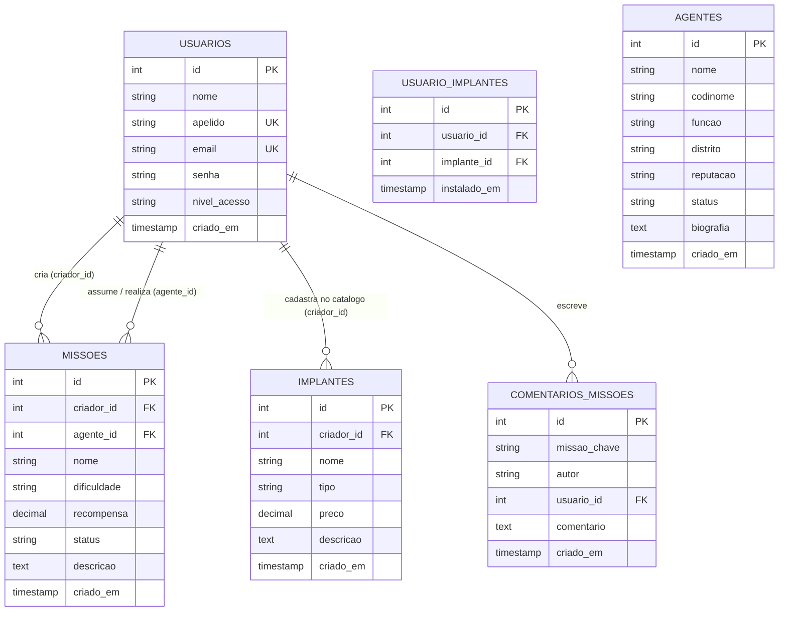

# Cyber Nexus — Cyberpunk Management System


> **"High Tech, Low Life."**  
> Um ecossistema de gerenciamento web imersivo com temática Cyberpunk, focado no controle, consulta, atualização e remoção de dados essenciais da rede (CRUD).

---

##  Especificação do Sistema & Regras de Negócio

###  Regras de Negócio (RN)

* **RN01 — Autenticação e Unicidade:** O cadastro exige e-mail e apelido de rede (*codinome*) únicos. Não é permitido duplicar e-mail ou apelido na rede.
* **RN02 — Níveis de Acesso:**
  * **Operador:** Pode criar missões, cadastrar implantes no catálogo, aceitar contratos do mural e equipar implantes em seu perfil.
  * **Admin:** Possui privilégios totais. Pode moderar e excluir qualquer conteúdo (missões, implantes, comentários, agentes) e gerenciar permissões de usuários.
* **RN03 — Atribuição de Missões:**
  * Uma missão pode ser criada por um **Operador** (`criador_id`).
  * Uma missão em aberto (`status = 'Pendente'`) só pode ser **aceita por um Operador diferente** (`agente_id`).
  * Ao ser aceita, o status da missão muda automaticamente para `'Em Andamento'`.
* **RN04 — Equipamento de Implantes:**
  * Qualquer Operador pode cadastrar novos modelos no catálogo de implantes (`criador_id`).
  * Um Operador pode equipar no seu perfil qualquer implante disponível no catálogo. A relação é registrada na tabela `usuario_implantes`.
* **RN05 — Proteção de Senhas:** Nenhuma senha pode ser salva em texto puro no banco de dados. É obrigatório o uso do algoritmo BCRYPT (`password_hash` / `password_verify`).

---

##  Requisitos do Sistema

###  Requisitos Funcionais (RF)

#### **RF01 — Módulo de Autenticação e Usuários**
* **RF01.1:** O sistema deve permitir que novos usuários se cadastrem fornecendo nome, apelido, e-mail e senha.
* **RF01.2:** O sistema deve permitir o login utilizando e-mail **ou** apelido de rede juntamente com a senha.
* **RF01.3:** O sistema deve manter a sessão ativa durante a navegação entre as páginas.
* **RF01.4:** O sistema deve permitir o encerramento da sessão (*logout*).

#### **RF02 — Módulo Administrativo (Admin)**
* **RF02.1:** O sistema deve disponibilizar um Dashboard restrito com métricas globais do sistema.
* **RF02.2:** O Admin deve poder visualizar a lista completa de usuários cadastrados.
* **RF02.3:** O Admin deve poder alterar o nível de acesso de um usuário (promover a `Admin` ou rebaixar a `Operador`).

#### **RF03 — Módulo de Implantes Cibernéticos**
* **RF03.1:** O sistema deve permitir listar todos os implantes cadastrados no catálogo.
* **RF03.2:** O sistema deve permitir o cadastro de novos implantes (nome, tipo, preço, descrição).
* **RF03.3:** O sistema deve permitir que o Admin ou o criador edite as informações de um implante.
* **RF03.4:** O sistema deve permitir a exclusão de implantes do catálogo.
* **RF03.5:** O sistema deve permitir que o usuário logado equipe um implante em seu perfil.

#### **RF04 — Módulo de Missões do Mural (Comunidade)**
* **RF04.1:** O sistema deve permitir a publicação de novos contratos de missões por usuários logados.
* **RF04.2:** O sistema deve exibir o mural de missões disponíveis com opção de filtragem por status.
* **RF04.3:** O sistema deve permitir que um operador aceite uma missão pendente, tornando-se o responsável por ela.
* **RF04.4:** O sistema deve permitir a edição e a remoção de missões do mural.

#### **RF05 — Módulo de Agentes da Rede**
* **RF05.1:** O sistema deve permitir cadastrar, listar, editar e excluir registros de Fixers, Mercenários, Netrunners e Solos.

#### **RF06 — Módulo de Missões do Jogo (Wiki)**
* **RF06.1:** O sistema deve exibir as informações técnicas e briefings das missões oficiais do Cyberpunk 2077.
* **RF06.2:** O sistema deve permitir que usuários logados enviem comentários e estratégias em cada missão.

---

###  Requisitos Não Funcionais (RNF)

* **RNF01 — Segurança:** O sistema deve utilizar *Prepared Statements* (PDO) em todas as requisições ao banco para prevenir **SQL Injection**.
* **RNF02 — Segurança de Acesso:** Páginas e scripts de ação restrita (como exclusão ou administrativas) devem validar a sessão do usuário antes de executar a lógica.
* **RNF03 — Banco de Dados:** O sistema deve utilizar o SGBD **PostgreSQL** garantindo a integridade referencial através de Chaves Estrangeiras (`FOREIGN KEY`).
* **RNF04 — Desempenho e Compatibilidade:** Aplicação web leve executável no servidor embutido do PHP (`php -S`) ou Apache (XAMPP).
* **RNF05 — Usabilidade e Interface:** Design responsivo adaptado para navegação em desktop e dispositivos móveis com temática Cyberpunk.
* **RNF06 — Padronização de Codificação:** Codificação de caracteres configurada em **UTF-8** no banco e na saída do PHP para preservar acentuação e caracteres especiais.

---


##  Modelagem do Banco de Dados (DER)



---

##  Estrutura do Projeto

```text
atividade final/
│
├── database/
│   ├── conexao.php             # Conexão PDO centralizada com o PostgreSQL
│   └── database.sql            # Script DDL SQL completo para criação das tabelas
│
├── includes/
│   ├── header.php              # Cabeçalho global com menu dinâmico (Sessão / Admin)
│   └── footer.php              # Rodapé do sistema
│
├── app/
│   ├── admin/                  # Módulo Restrito do Administrador
│   │   ├── index.php           # Dashboard do Admin com métricas do sistema
│   │   ├── usuarios.php        # Gestão e listagem de contas registradas
│   │   └── alterar_nivel.php   # Lógica para promover ou rebaixar usuários
│   │
│   ├── usuarios/               # Módulo de Autenticação
│   │   ├── index.php           # Tela com formulários de Login e Cadastro
│   │   ├── login.php           # Validação de credenciais e inicialização da sessão
│   │   ├── salvar_usuario.php  # Registro de novos operadores com hash BCRYPT
│   │   ├── logout.php          # Encerramento de sessão
│   │   └── cadastrar_admin_auto.php # Script utilitário para setup inicial do Admin
│   │
│   ├── implantes/              # Módulo do Catálogo de Implantes
│   │   ├── index.php           # Listagem e cadastro de implantes
│   │   ├── salvar_implante.php # Lógica de inserção e atualização
│   │   ├── editar_implante.php # Formulário de edição
│   │   └── excluir_implante.php# Remoção de registros
│   │
│   ├── missoes/                # Módulo de Contratos e Wiki
│   │   ├── index.php           # Hub do módulo
│   │   ├── mural.php           # Mural da Comunidade (Contratos criados por usuários)
│   │   ├── salvar_missao.php   # Lógica de criação/edição de contratos
│   │   ├── editar_missao.php   # Formulário de edição
│   │   ├── excluir_missao.php  # Exclusão de missões do mural
│   │   ├── jogo.php            # Wiki de missões do Cyberpunk 2077
│   │   └── salvar_comentario.php # Envio de dicas/comentários na wiki
│   │
│   └── agentes/                # Módulo de Agentes da Rede
│       ├── mural.php           # Registro de Fixers, Mercenários e Netrunners
│       ├── salvar_agente.php   # Inserção/atualização de agentes
│       ├── editar_agente.php   # Edição de perfil do agente
│       └── excluir_agente.php  # Remoção de agente
│
├── index.php                   # Portal inicial da aplicação
└── README.md                   # Documentação do projeto

```

---

##  Como Executar o Projeto

1. **Configurar o Banco de Dados:**
* Crie o banco de dados `cyber_nexus` no PostgreSQL.
* Execute o script contido em `database/database.sql`.


2. **Configurar a Conexão PHP:**
* Ajuste as credenciais no arquivo `database/conexao.php`.


3. **Iniciar o Servidor Web:**
```bash
php -S localhost:8000

```


* Acesse `http://localhost:8000` no navegador.


